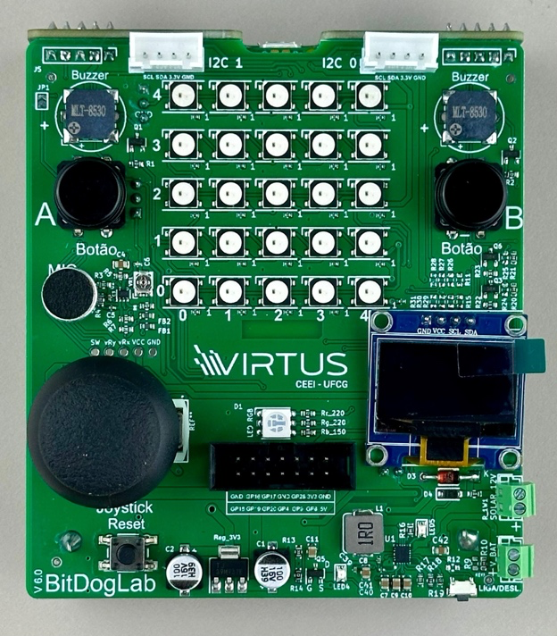

# Projeto para testar as bibliotecas de matriz de led, botões e buzzer

  

## Autores

- [Antonio Roberto](https://github.com/antoniojunior2222)
- [Ismael Marinho](https://github.com/smalljooj)

Este trabalho teve como objetivo validar a funcionalidade e viabilidade de bibliotecas de desenvolvimento para hardware embarcado, por meio da implementação de um sistema integrado que combina entrada analógica, saída visual e sonora. A proposta central consiste em um dispositivo interativo que mapeia posições de um joystick para notas musicais, com as seguintes funcionalidades-chave:

- Conversão Direcional-Sonora:
Translada movimentos do joystick em frequências sonoras específicas (escala musical temperada), permitindo a composição de melodias.

- Feedback Visual em Tempo Real:
Utiliza uma matriz de LEDs para exibir sprites que representam graficamente a direção do joystick (e.g., cima, baixo, diagonais).

- Seleção de Notas por Atuador:
Um botão físico confirma a nota associada à posição atual do joystick, habilitando a criação sequencial de arranjos musicais.

- Modo Demonstração Automática:
Reproduz uma sequência pré-programada de animações e sons, inspirada em trilhas retro de consoles 8-bit (e.g., chiptune), para validação do subsistema multimídia.

## Montagem do Projeto

### Componentes Utilizados

- 1x Placa Bitdoglab
- 1x Buzzer 
- 1x Matriz LED 5x5 (WS2812B/NeoPixel)
- 2x Botões (Botão A e B da placa)
- 1x Joystick

### Conexões

- **Buzzer**:
  - Sinal PWM: GPIO 21
- **Joystick**:
  - Eixo X: GPIO 26
  - Eixo Y: GPIO 27
  - Botão: GPIO 22
- **Matriz de LED**:
  - Barramento de dados: GPIO 7
- **Botões A/B**:
  - GPIO 5
  - GPIO 6

## Bibliotecas Utilizadas

- **Buzzer**: 
    - Autor: Pedro Augusto Gonçalves Lucena 
    - [Link](https://github.com/pedrodev3005/pico-buzzer-lib)
- **Matriz de Led**: 
    - Autor:  Francisco Bezerra Da Silva Neto 
    - [Link](https://github.com/Chico0212/pico-led-matrix-lib/tree/main)
- **Botões**:
    - Autor: Pedro Augusto Gonçalves Lucena
    - [Link](https://github.com/pedrodev3005/pico-button-lib)

As bibliotecas foram renomeadas para os nomes descritos no github, separadas e colocadas na pasta lib, com
CMakeLists separados, para serem adicionadas como dependências separadas.

## Funções utilizadas 

### Biblioteca do buzzer(`pico_buzzer_lib`)

A biblioteca `pico_buzzer_lib` gerencia a inicialização e configuração do buzzer, em relação a frequência e volume. 

1. **` void buzzer_init(Buzzer *buzzer, uint pin, uint freq) `**
    - Validação da Frequência
    - Configuração da Estrutura `Buzzer`
    - Configuração do GPIO
    - Configuração do PWM
    - Inicialização do Nível do PWM

2. **` void buzzer_set_frequency(Buzzer *buzzer, uint frequency) `**
    - Identificação do "Slice" PWM
    - Atualização da Frequência do PWM
    - Configuração do Ciclo de Trabalho
    - Atualização da Frequência na Estrutura

3. **` void buzzer_set_volume(Buzzer *buzzer, uint volume)  `**
    - Limitação do Valor de Volume
    - Cálculo do Nível PWM
    - Aplicação do Novo Nível

---

### Biblioteca da Matriz de LED (`pico_led_matrix_lib`)

A biblioteca `pico_led_matrix_lib` controla uma matriz de LED 5x5, permitindo a exibição de sprites e a alteração dinâmica das cores.

1. **` void init(uint8_t pin) `**
    - Inicializa a matriz de LED, configurando o PIO e a máquina de estados.
    - **Detalhes**:
    - Configura o pino para controle dos LEDs NeoPixel.

2. **` void matrix_write() `**
    - Envia os dados do buffer de pixels para os LEDs.
    - **Detalhes**:
    - Deve ser chamada após definir as cores dos LEDs para atualizar a matriz.

5. **`void display_sprite(const int sprite[5][5][3])`**
    - Exibe um sprite na matriz de LED.
    - **Detalhes**:
    - `sprite`: Matriz 5x5x3 contendo os valores de intensidade para cada LED.

### Biblioteca do Botão (`pico_button_lib`)

A biblioteca `pico_button_lib` gerencia a inicialização, configuração dos botões e criação dos callbacks.  

1. **` void buzzer_init(Buzzer *buzzer, uint pin, uint freq) `**
    - Configura o GPIO como entrada 
    - Configura o pino como Pull UP ou Pull Down

5. **`void button_register_callback(uint gpio, select_button button, enum gpio_irq_level irq_level,void (*callback)(uint, uint32_t)) `**
    - Guarda um ponteiro para a função de callback que será executada dependendo do botão.
    - Registra a função interna de callback, já com debounce
    
3. **` void button_callback_internal(uint gpio, uint32_t events) `**
    - Identificação do Botão
    - Debounce por Tempo
    - Atualização do Timestamp
    - Validação do Evento
    - Execução do Callback

---

## Código Principal

## Funções Implementadas

### 1. **`main()`**
- **Propósito:** Configurar e gerenciar o fluxo principal do programa.
- **Ações:**
  - Inicializa periféricos: GPIO, joystick, buzzer, botões.
  - Registra callbacks para os botões A e B (`button_register_callback`).
  - Loop principal:
    - Captura e normaliza dados do joystick.
    - Atualiza a matriz de LEDs com sprites baseados na direção do joystick.
    - Controla a frequência do buzzer conforme o estado da variável `notas` para que soem como notas musicais.

---

### 2. **`botao_a_interrupcao()`**
- **Propósito:** Callback para o botão A (GPIO 5).
- **Comportamento:**
  - Ativa o modo de demonstração (`demo = 1`).

---

### 3. **`botao_b_interrupcao()`**
- **Propósito:** Callback para o botão B (GPIO 6).
- **Comportamento:**
  - Mapeia a direção atual do joystick (via `get_direcao()`) para notas musicais:
    - Exemplo: Direção `CIMA2` → Nota Dó (`DO`).

---

### 4. **`demonstracao()`**
- **Propósito:** Executar uma sequência pré-definida de animações e sons.
- **Etapas:**
  1. Atualiza cores e sprites na matriz de LEDs.
  2. Toca notas musicais sequenciais (de Dó a Dó2).
  3. Finaliza com animação especial (`final1/final2`).

---

## Instruções

### Como Compilar e Executar

1. **Requisitos**:
   - Visual Studio Code
   - Extensão Rapsberry Pi Pico

2. **Compilação**:
   - Importe o projeto pela interface da extensão e coloque a versão 1.5.1

3. **Execução**:
   - Conecte a Raspberry Pi Pico ao computador via USB.
   - Carregue o arquivo `.uf2` gerado na Pico, ou instale o zadig para executar diretamente do VSCode.

4. **Interação**:
   - Fale ou coloque um som próximo ao microfone.

---
## Demonstração

### OBS: Se desejar ver os videos demonstrativos, basta baixa-los na pasta images.
---
## Considerações finais

Não foi possível criar o projeto apenas com o código disponibilizado devido a erros, falta de implementações e ajustes necessários para melhorar o funcionamento das bibliotecas. A seguir, são detalhados os principais pontos observados:

### Botões

A biblioteca carece de documentação adequada para as funções implementadas. No entanto, os problemas mais relevantes foram identificados na definição dos botões e na atribuição de seus respectivos callbacks. As principais dificuldades encontradas foram:

- O funcionamento da inicialização (init) é genérico e pode ser utilizado para qualquer GPIO na placa. No entanto, a função de callback não segue essa mesma lógica, exigindo que o botão seja especificamente o Botão A ou Botão B.

- A função que define os callbacks estava confusa e não permitia uma configuração clara. Para manter a proposta original da biblioteca, foi adicionada uma nova estrutura que permite ao usuário definir qual dos dois botões deseja configurar com um callback específico.

- A implementação original tornava obrigatório o uso de interrupções nos eventos RISE e FALL do botão, o que levava a uma chamada desnecessária da rotina de interrupção para verificar se o estado atual era diferente do anterior.

Dessa forma, foi criada uma nova função para configuração dos callbacks:

`button_register_callback(uint gpio, select_button button, enum gpio_irq_level irq_level,void (*callback)(uint, uint32_t))` 

Os parâmetros dessa função são:

- gpio: Define o GPIO utilizado (mantido como argumento para preservar a lógica original).

- button: Define qual botão está sendo configurado (BUTTON_A ou BUTTON_B).

- irq_level: Define o tipo de interrupção (FALL ou RISE).

- callback: Define a função de callback associada ao botão.

### Matriz de Led

A biblioteca da matriz LED já funcionava corretamente em sua versão original, sem apresentar erros ou instabilidades. No entanto, para atender plenamente às necessidades do nosso projeto, implementamos duas funcionalidades essenciais: a função display_sprite(), que permite carregar e exibir sprites personalizados na matriz através de um array tridimensional que define a posição e cor de cada LED, e a função set_cor(), que simplifica o controle visual ao permitir a mudança simultânea de cor para toda a matriz com um único comando. Essas melhorias trouxeram maior flexibilidade para criar animações e feedbacks visuais dinâmicos.

### Buzzer

Houve falhas na funcionalidade de tocar melodias, o que levou à necessidade de implementar um novo método próprio para essa função. Além disso, foi 
identificada a ausência de uma chamada à função `pwm_set_wrap`, o que prejudicava a precisão do som gerado.  
Outro problema encontrado foi no controle de volume, que apenas funcionava corretamente para a opção mute, sem permitir ajustes intermediários.

---

## Fontes

- [Raspberry Pi Pico SDK](https://github.com/raspberrypi/pico-sdk)
- [Biblioteca NeoPixel para Pico](https://github.com/raspberrypi/pico-examples/tree/master/pio/ws2812)
- [Biblioteca do Buzzer](https://github.com/pedrodev3005/pico-buzzer-lib)
- [Biblioteca da Matriz de Led](https://github.com/Chico0212/pico-led-matrix-lib/tree/main)
- [Biblioteca dos Botões](https://github.com/pedrodev3005/pico-button-lib)
- [Biblioteca do Joystick](https://github.com/AntonioJunior2222/BitDogLab-Joystick-Matriz_Led-VIRTUS_CC)
